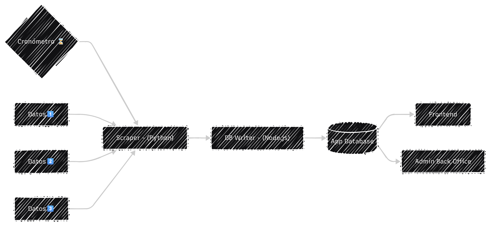

# Brief de Arquitectura

En este documento definimos las decisiones técnicas y el stack tecnológico para el desarrollo del producto.

---

## 1. Stack Tecnológico por Microservicio

| Microservicio | Tecnología Recomendada | Justificación |
| --- | --- | --- |
| System API | NestJS (Node.js/TypeScript) | Arquitectura modular, rendimiento en I/O, escalabilidad |
| Scraper | FastAPI (Python) | Ecosistema maduro de scraping (BeautifulSoup, Scrapy, Playwright) |
| AI Curator | FastAPI (Python) | Librerías líderes de IA/ML (scikit-learn, TensorFlow, spaCy) |
| DB Writer | NestJS (Node.js) | Consistencia con System API, manejo asíncrono de escrituras |
| Mensajería | RabbitMQ | Simplicidad inicial, colas confiables, clientes en Python y Node.js |
| Base de Datos | PostgreSQL | Datos estructurados, integridad referencial, JSONB para flexibilidad |
| Frontend | React con TypeScript | Interfaz moderna, tipado estático, ecosistema robusto |

## 2. Justificación del Enfoque Mixto

> Python para procesamiento de datos:

    Ventaja en scraping y procesamiento de datos
    Ecosistema líder en IA/ML para curar y clasificar productos
    FastAPI ofrece rendimiento comparable a Node.js
    
> Node.js para orquestación y APIs:

    Excelente para I/O asíncrono (conexiones múltiples)
    NestJS proporciona arquitectura empresarial desde el inicio
    Unificado con el frontend (TypeScript en ambos lados)

## 3. Flujo y Diagrama de Datos

<a href="https://mermaid.ai/d/dbaedb51-ba63-4583-9369-264cb629f7a0" target="_blank" rel="noopener noreferrer">
    
    Click para ver el diagrama en la web - Mermaid
</a>

## 4. Consideraciones de Escalabilidad

📈 Evolución de la Infraestructura:

Componente | Fase Inicial | Fase de Escala
| --- | --- | --- |
Mensajería | RabbitMQ | Kafka para alto volumen de eventos
Base de Datos | PostgreSQL básico | Particionamiento por categoría + réplicas
Despliegue | Docker containers | Kubernetes + orquestación
API Gateway | NestJS como gateway inicial | Kong/Traefik dedicado

🐋 Contenedorización:

    Docker desde el inicio para consistencia de entornos
    Docker Compose para desarrollo local
    CI/CD pipeline con pruebas automatizadas

## 5. Ventajas del Stack Propuesto

✅ Beneficios Clave:
Ventaja | Impacto
| --- | --- |
Separación clara de responsabilidades | Mantenibilidad y debugging sencillo
Lenguaje óptimo para cada tarea | Máximo rendimiento en cada módulo
Curva de aprendizaje manejable | TypeScript unifica frontend y backend principal
Escalabilidad horizontal por microservicio | Escala solo lo necesario, optimiza costos
Interfaces bien definidas entre servicios | Facilita testing y evolución independiente

🎯 Ventajas Adicionales:

    🔧 Flexibilidad tecnológica: Puedes reemplazar componentes sin afectar el sistema completo
    📊 Monitoreo unificado: Compatible con herramientas como Prometheus/Grafana
    🔐 Seguridad por capas: Cada servicio puede tener su propia política de seguridad
    🌍 Compatibilidad cloud: Diseñado para despliegue en AWS, GCP o Azure sin modificaciones